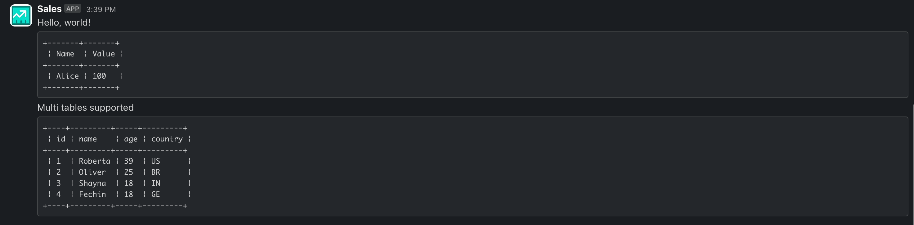

# TableConverter Apex Class

The `TableConverter` Apex class provides utility methods to convert HTML tables into tab-separated values (TSV), format TSV data into ASCII tables, and prepare textual content (including HTML) for Slack-friendly formats. This class is especially useful for developers working with data transformations in Salesforce, particularly when needing to convert or reformat structured data.

## Key Features

1. **HTML to TSV Conversion**: Transform HTML table structures into tab-separated strings, ideal for use in plain-text scenarios or data processing.
2. **TSV to ASCII Table Formatting**: Generate readable ASCII tables from TSV data for environments without rich formatting capabilities.
3. **Slack-Compatible Content Preparation**: Reformat mixed HTML content, including tables, into a Slack-friendly format using code blocks and ASCII tables for improved readability.

---

## Class Methods

### 1. `convertHtmlTableToTab`
Converts an HTML table into a tab-separated string.

#### Parameters:
- `htmlTable` (*String*): The HTML table content.

#### Returns:
- A tab-separated string representing the table data.

#### Example:
```java
String html = '<table><tr><th>Name</th><th>Value</th></tr><tr><td>Alice</td><td>100</td></tr></table>';
String result = TableConverter.convertHtmlTableToTab(html);
System.debug(result);
// Output:
// Name\tValue\nAlice\t100
```

---

### 2. `convertTabToAscii`
Converts a tab-separated string into an ASCII table format.

#### Parameters:
- `tabTable` (*String*): Tab-separated string data.

#### Returns:
- An ASCII-formatted string representing the table data.

#### Example:
```java
String tabData = 'Name\tValue\nAlice\t100';
String asciiTable = TableConverter.convertTabToAscii(tabData);
System.debug(asciiTable);
// Output:
// +------+-------+
// ¦ Name ¦ Value ¦
// +------+-------+
// ¦ Alice¦ 100   ¦
// +------+-------+
```

---

### 3. `prepareForSlack`
Prepares input content, including HTML, for Slack-friendly formatting. Handles HTML tags, converts tables to ASCII, and removes unnecessary HTML content.

#### Parameters:
- `input` (*String*): The input string containing HTML content.

#### Returns:
- A string formatted for Slack with code blocks and plain text.

#### Example:
```java
String htmlContent = '<p>Hello, world!</p><table><tr><th>Name</th><th>Value</th></tr><tr><td>Alice</td><td>100</td></tr></table><p>Multi tables supported</p><table><tr><td>id</td><td>name</td><td>age</td><td>country</td></tr><tr><td>1</td><td>Roberta</td><td>39</td><td>US</td></tr><tr><td>2</td><td>Oliver</td><td>25</td><td>BR</td></tr><tr><td>3</td><td>Shayna</td><td>18</td><td>IN</td></tr><tr><td>4</td><td>Fechin</td><td>18</td><td>GE</td></tr></table>';
String slackContent = TableConverter.prepareForSlack(htmlContent);
System.debug(slackContent);
// Output:
//Hello, world!
//```+-------+-------+
// ¦ Name  ¦ Value ¦ 
//+-------+-------+
// ¦ Alice ¦ 100   ¦ 
//+-------+-------+
//```
//Multi tables supported
//```+----+---------+-----+---------+
// ¦ id ¦ name    ¦ age ¦ country ¦ 
//+----+---------+-----+---------+
// ¦ 1  ¦ Roberta ¦ 39  ¦ US      ¦ 
// ¦ 2  ¦ Oliver  ¦ 25  ¦ BR      ¦ 
// ¦ 3  ¦ Shayna  ¦ 18  ¦ IN      ¦ 
// ¦ 4  ¦ Fechin  ¦ 18  ¦ GE      ¦ 
//+----+---------+-----+---------+
//```
```

#### Slack message example:


---

## Installation and Usage

To use this class in your Salesforce org:

1. Copy the `TableConverter` class into your Salesforce development environment.
2. Deploy the class to your org.
3. Call the methods directly in your Apex code where required.

### Test Coverage
Ensure thorough test coverage by writing unit tests for all methods, including edge cases (e.g., empty inputs, malformed HTML, large tables).